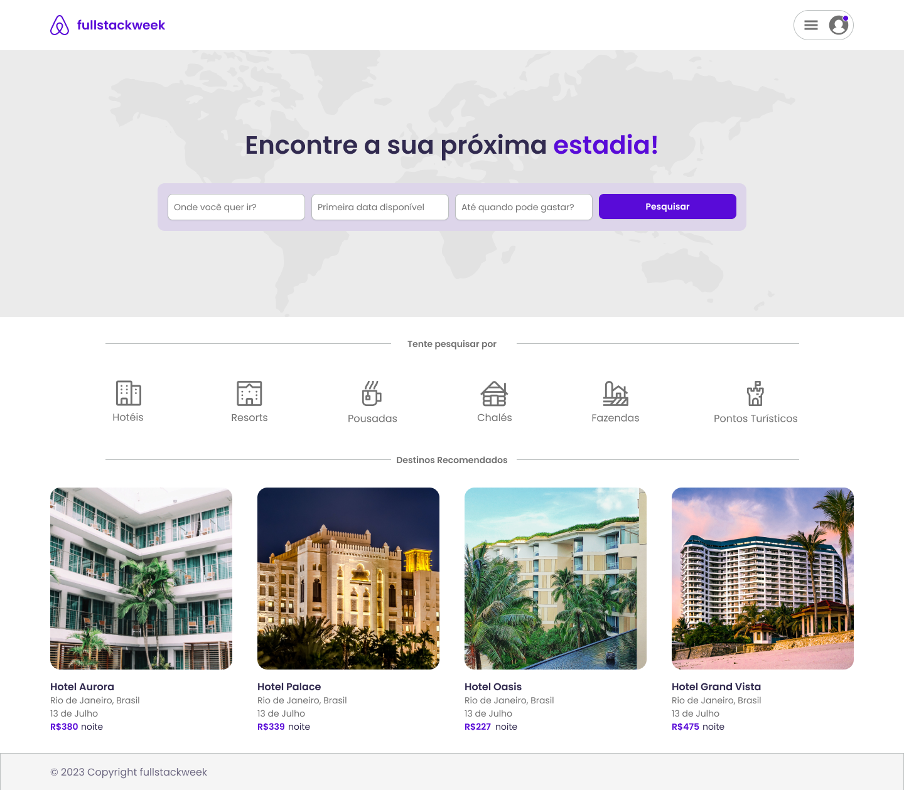
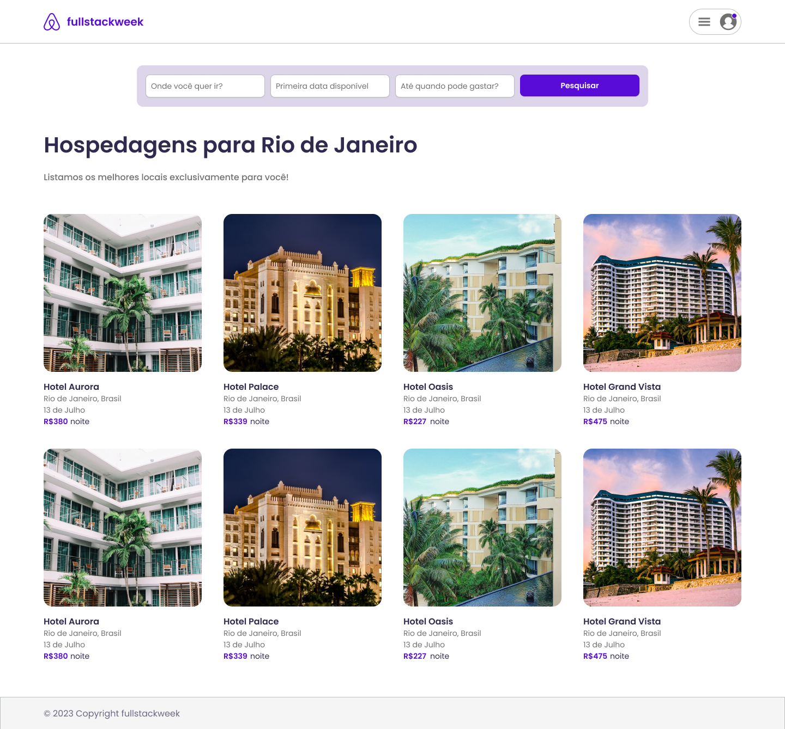
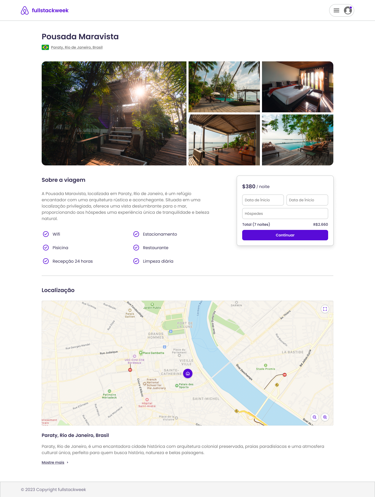
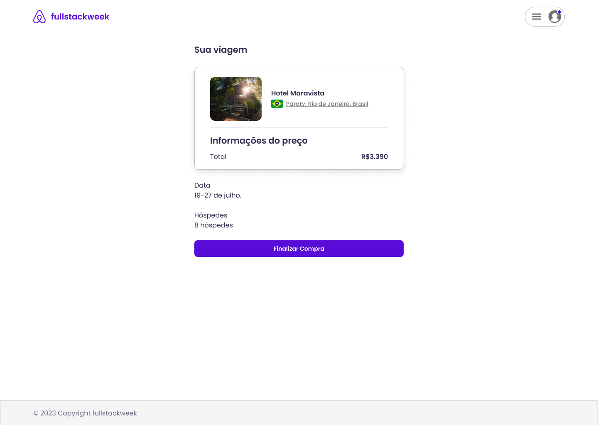
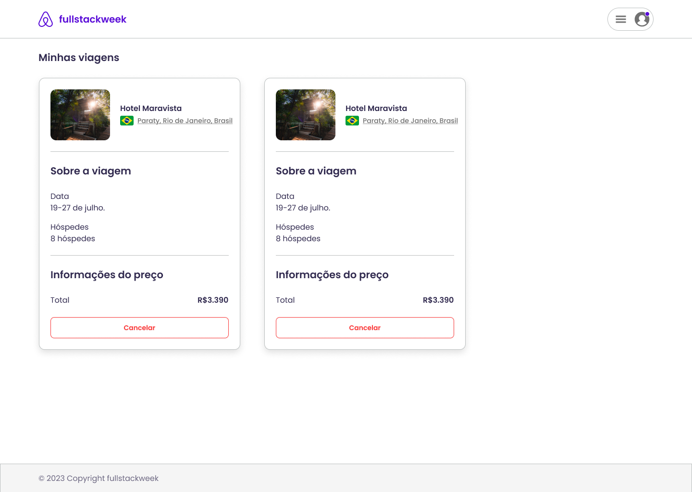

<a name="readme-top"></a>

<div align="center">

[![MIT License][license-shield]][license-url]
[![Version][version-shield]][version-shield]

</div>

<br />
<div align="center">
    <a href="https://github.com/joaosouza7/fullstackweek-trips">
    
    </a>
    <br />
    <br />

  <h3 align="center">Sistema de Reserva de Viagens</h3>

  <p align="center">
    Encontre a viagem perfeita para aproveitar suas férias.
    <br />
    <a href="https://fullstackweek-trips-joaosouza7.vercel.app/"><strong>Explore o projeto »</strong></a>
    <br />
    <br />
    <a href="#sobre">Sobre</a> •
    <a href="#features">Features</a> • 
    <a href="#tecnologias">Tecnologias</a> • 
    <a href="#preview">Preview</a> • 
    <a href="#como-executar">Como executar?</a> • 
    <a href="#licenca">Licença</a> •
    <a href="#contato">Contato</a>
  </p>
</div>

<!--Sobre o Projeto-->
<h2 id="sobre">💻 Sobre o projeto</h2>

Esse projeto trata-se de um sistema de reserva de viagens, que permite ao usuário, buscar viagens com base em parâmetros como: data, orçamento, bem como, tipo de hospedagem. Além disso, são apresentados os detalhes da viagem, exibindo as fotos do local escolhido, descrição, localização e destaques.

Ademais a aplicação possui autenticação com o [Google][google] e integração com o sistema de pagamentos [Stripe][stripe].

<!--Features-->
<h2 id="features">✅ Features</h2>

Atualmente essas são as principais funcionalidades presentes na aplicação, sendo possível a adição de novas features posteriormente.

-   [x] Cadastro de usuários
-   [x] Autenticação com sua conta do [Google][google]
-   [x] Busca de viagens
-   [x] Lista de viagens recomendadas
-   [x] Vizualizar minhas viagens
-   [x] Reservar viagens
-   [x] Integração com o sistema de pagamentos [Stripe][stripe]

<!--Tecnologias-->
<h2 id="tecnologias">🛠 Tecnologias utilizadas</h2>

As seguintes ferramentas foram utilizadas no desenvolvimento do projeto.

#### **Website** ([Next][next] + [Typescript][typescript-url] + [Tailwind][tailwind])

-   [Next.js][next]
-   [Next Auth][next-auth]
-   [React Icons][reacticons-url]
-   [Typescript][typescript-url]
-   [Tailwind][tailwind]

#### **Server** ([Node][node-url] + [Typescript][typescript-url])

-   [Server Component][server-component]
-   [Node][node-url]
-   [Prisma][prisma]
-   [PostgreSQL][postgresql]
-   [Express][expressjs]

> Veja o arquivo [package.json](https://github.com/joaosouza7/fullstackweek-trips/blob/main/package.json)

<!--Preview do projeto-->
<h2 id="preview">🔎 Preview do projeto</h2>

<div align="center">

### Home

  

### Busca

  

### Detalhes

  

### Finalizar Compra

  

### Minhas viagens

  
</div>

<!--Como executar-->
<h2 id="como-executar">🚀 Como executar o projeto?</h2>

### Pré-requisitos

Antes de começar, você vai precisar ter instalado em sua máquina as seguintes ferramentas:
[Git][git-url], [Node][node-url].
Além disso, é bom ter um editor para trabalhar com o código como o [VSCode][vscode-url].

### 🎲 Rodando a aplicação

```bash
# Clone este repositório
$ git clone https://github.com/joaosouza7/fullstackweek-trips

# Acesse a pasta do projeto no terminal/cmd
$ cd fullstackweek-trips

# Instale as dependências do projeto
$ yarn | npm install

# Inicialize a aplicação
$ yarn dev | npm run dev
```

<!--Licença-->
<h2 id="licenca">📝 Licença</h2>

Esse projeto está sob a licença [MIT][license-url].

Veja o arquivo `LICENSE` para mais detalhes.

<!--Contato-->
<h2 id="contato">✉️ Contato</h2>

João Souza - [Linkedin](https://www.linkedin.com/in/joao-souza07/) - joaoosouza07@gmail.com

Portfólio - https://portfolio-joaosouza7.vercel.app/

<p align="right">(<a href="#readme-top">🔝 Voltar ao topo</a> )</p>

<!-- LINKS E IMAGENS -->

[license-shield]: https://img.shields.io/badge/LICENSE-MIT-green?style=for-the-badge
[license-url]: ./LICENSE
[version-shield]: https://img.shields.io/badge/VERSION-1.0.0-dc3545?style=for-the-badge
[next]: https://nextjs.org/
[next-auth]: https://next-auth.js.org/
[tailwind]: https://tailwindcss.com/
[google]: https://www.google.com/intl/pt-BR/gmail/about/
[stripe]: https://stripe.com/br
[git-url]: https://git-scm.com
[node-url]: https://nodejs.org/en
[postgresql]: https://www.postgresql.org/
[expressjs]: https://expressjs.com/pt-br/
[vscode-url]: https://code.visualstudio.com/
[server-component]: https://nextjs.org/docs/getting-started/react-essentials
[prisma]: https://www.prisma.io/
[react-url]: https://react.dev/
[typescript-url]: https://www.typescriptlang.org/
[reacticons-url]: https://react-icons.github.io/react-icons/
